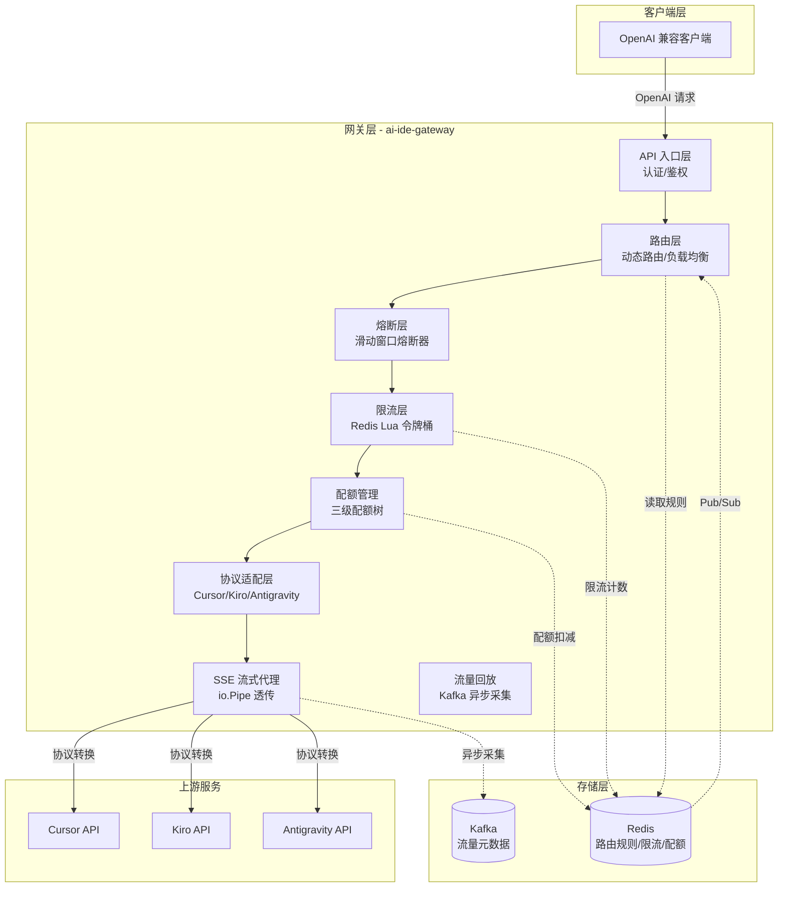
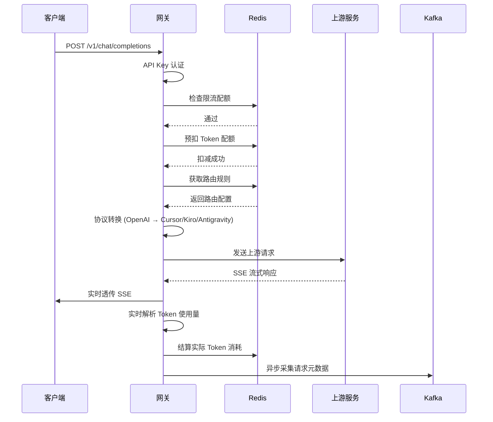
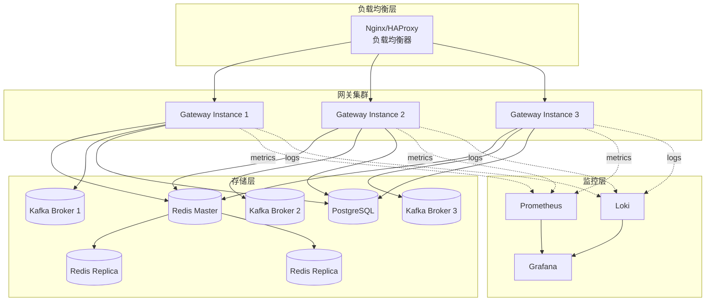

# Design Document: ai-ide-gateway

## Overview

ai-ide-gateway 是一个基于 Go 的高性能 AI IDE 模型 API 反代与治理网关系统。该系统旨在解决 Cursor、Kiro、Antigravity 等 AI IDE 内置模型无独立 API、多模型切换成本高、调用不稳定等问题，通过协议适配、动态路由、熔断限流、流式代理等核心能力，对外暴露统一的 OpenAI 兼容接口。

### 设计目标

1. **协议统一**：将 Cursor/Kiro/Antigravity 三种非标协议统一转换为 OpenAI 标准协议
2. **高可用性**：通过三级故障切换和健康探测机制保证服务稳定性
3. **高性能**：限流 P99 延迟 < 2ms，1000 并发 SSE 首 Token 延迟增量 < 15ms
4. **精确计量**：三级配额树结构 + 预扣结算机制实现精确 Token 计量
5. **可观测性**：完整的监控指标、结构化日志和流量回放能力

### 核心能力

- 多协议适配层（Cursor/Kiro/Antigravity → OpenAI）
- 动态路由与三级故障切换
- 分布式熔断与限流
- SSE 流式透传代理
- 三级 Token 配额管理
- Kafka 异步流量回放
- Prometheus 监控与结构化日志


## Architecture

### 系统架构图



### 数据流向



### 核心组件职责

| 组件 | 职责 | 技术选型 |
|------|------|----------|
| API 入口层 | HTTP 请求接收、API Key 认证、请求路由分发 | Go net/http, Gin/Echo |
| 路由层 | 动态路由规则加载、负载均衡、故障切换 | Redis Pub/Sub |
| 熔断层 | 滑动窗口错误率统计、熔断状态管理 | 内存滑动窗口 |
| 限流层 | 分布式令牌桶限流、多维度限流 | Redis + Lua |
| 协议适配层 | OpenAI ↔ Cursor/Kiro/Antigravity 协议转换 | 工厂模式 + 适配器模式 |
| SSE 代理层 | 流式透传、Token 实时解析、连接管理 | io.Pipe + goroutine |
| 配额管理 | 三级配额树、预扣结算、原子操作 | Redis + Lua |
| 流量回放 | 异步元数据采集、历史查询、对比回放 | Kafka + Consumer |
| 监控层 | 指标采集、日志输出 | Prometheus + Zap |


## Components and Interfaces

### 1. 协议适配层设计

#### 1.1 适配器接口定义

```go
// ProtocolAdapter 定义协议适配器接口
type ProtocolAdapter interface {
    // ConvertRequest 将 OpenAI 请求转换为上游协议请求
    ConvertRequest(ctx context.Context, req *OpenAIRequest) (*UpstreamRequest, error)
    
    // ConvertResponse 将上游响应转换为 OpenAI 响应
    ConvertResponse(ctx context.Context, resp *UpstreamResponse) (*OpenAIResponse, error)
    
    // ConvertStreamChunk 转换流式响应数据块
    ConvertStreamChunk(ctx context.Context, chunk []byte) (*OpenAIStreamChunk, error)
    
    // GetProviderType 返回上游服务提供商类型
    GetProviderType() ProviderType
}

// ProviderType 上游服务提供商类型
type ProviderType string

const (
    ProviderCursor      ProviderType = "cursor"
    ProviderKiro        ProviderType = "kiro"
    ProviderAntigravity ProviderType = "antigravity"
)
```

#### 1.2 适配器工厂

```go
// AdapterFactory 协议适配器工厂
type AdapterFactory struct {
    adapters map[ProviderType]ProtocolAdapter
}

func NewAdapterFactory() *AdapterFactory {
    return &AdapterFactory{
        adapters: map[ProviderType]ProtocolAdapter{
            ProviderCursor:      NewCursorAdapter(),
            ProviderKiro:        NewKiroAdapter(),
            ProviderAntigravity: NewAntigravityAdapter(),
        },
    }
}

func (f *AdapterFactory) GetAdapter(provider ProviderType) (ProtocolAdapter, error) {
    adapter, ok := f.adapters[provider]
    if !ok {
        return nil, fmt.Errorf("unsupported provider: %s", provider)
    }
    return adapter, nil
}
```

#### 1.3 Cursor 适配器实现

```go
type CursorAdapter struct {
    httpClient *http.Client
}

func (a *CursorAdapter) ConvertRequest(ctx context.Context, req *OpenAIRequest) (*UpstreamRequest, error) {
    // 1. 提取模型名称和参数
    // 2. 构建 Cursor 特定的请求格式
    // 3. 添加 Cursor 特定的认证头
    cursorReq := &CursorRequest{
        Model:       mapModelName(req.Model),
        Messages:    convertMessages(req.Messages),
        Temperature: req.Temperature,
        MaxTokens:   req.MaxTokens,
        Stream:      req.Stream,
    }
    
    return &UpstreamRequest{
        URL:     "https://api.cursor.sh/v1/chat",
        Method:  "POST",
        Headers: buildCursorHeaders(),
        Body:    cursorReq,
    }, nil
}
```

#### 1.4 Kiro 适配器实现

```go
type KiroAdapter struct {
    tokenManager *KiroTokenManager
}

func (a *KiroAdapter) ConvertRequest(ctx context.Context, req *OpenAIRequest) (*UpstreamRequest, error) {
    // 1. 刷新 OAuth Token
    token, err := a.tokenManager.GetValidToken(ctx)
    if err != nil {
        return nil, err
    }
    
    // 2. 构建 Kiro 请求格式
    kiroReq := &KiroRequest{
        Model:    mapToKiroModel(req.Model),
        Messages: convertToKiroMessages(req.Messages),
        Config: KiroConfig{
            MaxTokens:   req.MaxTokens,
            Temperature: req.Temperature,
        },
    }
    
    return &UpstreamRequest{
        URL:    "https://api.kiro.ai/v1/messages",
        Method: "POST",
        Headers: map[string]string{
            "Authorization": "Bearer " + token,
            "X-Kiro-Region": "us-east-1",
        },
        Body: kiroReq,
    }, nil
}
```


### 2. 路由与故障切换设计

#### 2.1 路由规则数据结构

```go
// RouteRule 路由规则
type RouteRule struct {
    ModelID       string              `json:"model_id"`        // 模型标识
    Provider      ProviderType        `json:"provider"`        // 上游服务商
    APIKeys       []APIKeyConfig      `json:"api_keys"`        // API Key 列表
    FallbackChain []FallbackConfig    `json:"fallback_chain"`  // 故障切换链
    LoadBalancer  LoadBalancerType    `json:"load_balancer"`   // 负载均衡策略
    HealthCheck   HealthCheckConfig   `json:"health_check"`    // 健康检查配置
    UpdatedAt     time.Time           `json:"updated_at"`      // 更新时间
}

// APIKeyConfig API Key 配置
type APIKeyConfig struct {
    Key       string    `json:"key"`         // API Key
    Weight    int       `json:"weight"`      // 权重（用于加权轮询）
    Status    KeyStatus `json:"status"`      // 状态
    LastCheck time.Time `json:"last_check"`  // 最后检查时间
}

type KeyStatus string

const (
    KeyStatusActive   KeyStatus = "active"
    KeyStatusCooldown KeyStatus = "cooldown"  // 冷却中
    KeyStatusFailed   KeyStatus = "failed"    // 失败
)

// FallbackConfig 故障切换配置
type FallbackConfig struct {
    Level     int          `json:"level"`      // 切换级别 (1=同模型备用Key, 2=替代模型, 3=兜底模型)
    ModelID   string       `json:"model_id"`   // 目标模型
    Provider  ProviderType `json:"provider"`   // 目标服务商
    Condition string       `json:"condition"`  // 触发条件
}

type LoadBalancerType string

const (
    LoadBalancerRoundRobin LoadBalancerType = "round_robin"
    LoadBalancerRandom     LoadBalancerType = "random"
    LoadBalancerWeighted   LoadBalancerType = "weighted"
)
```

#### 2.2 路由管理器

```go
// RouteManager 路由管理器
type RouteManager struct {
    redis       *redis.Client
    rules       sync.Map  // modelID -> *RouteRule
    subscriber  *redis.PubSub
    logger      *zap.Logger
}

func (m *RouteManager) LoadRules(ctx context.Context) error {
    // 从 Redis 加载所有路由规则
    keys, err := m.redis.Keys(ctx, "route:*").Result()
    if err != nil {
        return err
    }
    
    for _, key := range keys {
        data, err := m.redis.Get(ctx, key).Result()
        if err != nil {
            continue
        }
        
        var rule RouteRule
        if err := json.Unmarshal([]byte(data), &rule); err != nil {
            continue
        }
        
        m.rules.Store(rule.ModelID, &rule)
    }
    
    return nil
}

func (m *RouteManager) SubscribeUpdates(ctx context.Context) {
    // 订阅 Redis Pub/Sub 通道
    m.subscriber = m.redis.Subscribe(ctx, "route:updates")
    
    go func() {
        for msg := range m.subscriber.Channel() {
            var update RouteUpdateEvent
            if err := json.Unmarshal([]byte(msg.Payload), &update); err != nil {
                m.logger.Error("failed to parse route update", zap.Error(err))
                continue
            }
            
            // 更新本地缓存
            m.rules.Store(update.ModelID, update.Rule)
            m.logger.Info("route rule updated", zap.String("model", update.ModelID))
        }
    }()
}

func (m *RouteManager) SelectAPIKey(modelID string) (*APIKeyConfig, error) {
    // 根据负载均衡策略选择 API Key
    ruleVal, ok := m.rules.Load(modelID)
    if !ok {
        return nil, fmt.Errorf("no route rule for model: %s", modelID)
    }
    
    rule := ruleVal.(*RouteRule)
    
    // 过滤可用的 API Key
    activeKeys := make([]*APIKeyConfig, 0)
    for i := range rule.APIKeys {
        if rule.APIKeys[i].Status == KeyStatusActive {
            activeKeys = append(activeKeys, &rule.APIKeys[i])
        }
    }
    
    if len(activeKeys) == 0 {
        return nil, fmt.Errorf("no active API key for model: %s", modelID)
    }
    
    // 根据负载均衡策略选择
    switch rule.LoadBalancer {
    case LoadBalancerRoundRobin:
        return m.roundRobinSelect(activeKeys), nil
    case LoadBalancerRandom:
        return activeKeys[rand.Intn(len(activeKeys))], nil
    case LoadBalancerWeighted:
        return m.weightedSelect(activeKeys), nil
    default:
        return activeKeys[0], nil
    }
}
```


#### 2.3 三级故障切换逻辑

```go
// FailoverExecutor 故障切换执行器
type FailoverExecutor struct {
    routeManager *RouteManager
    circuitBreaker *CircuitBreaker
    logger       *zap.Logger
}

func (e *FailoverExecutor) ExecuteWithFailover(ctx context.Context, req *OpenAIRequest) (*OpenAIResponse, error) {
    modelID := req.Model
    
    // Level 1: 尝试主 API Key
    resp, err := e.tryPrimaryKey(ctx, req, modelID)
    if err == nil {
        return resp, nil
    }
    
    e.logger.Warn("primary key failed, trying backup keys", 
        zap.String("model", modelID), 
        zap.Error(err))
    
    // Level 2: 尝试同模型的备用 Key
    resp, err = e.tryBackupKeys(ctx, req, modelID)
    if err == nil {
        return resp, nil
    }
    
    e.logger.Warn("all keys failed, trying alternative models", 
        zap.String("model", modelID), 
        zap.Error(err))
    
    // Level 3: 尝试替代模型
    resp, err = e.tryAlternativeModels(ctx, req, modelID)
    if err == nil {
        return resp, nil
    }
    
    e.logger.Error("all alternatives failed, using fallback model", 
        zap.String("model", modelID), 
        zap.Error(err))
    
    // Level 4: 使用兜底模型
    return e.tryFallbackModel(ctx, req)
}

func (e *FailoverExecutor) tryPrimaryKey(ctx context.Context, req *OpenAIRequest, modelID string) (*OpenAIResponse, error) {
    apiKey, err := e.routeManager.SelectAPIKey(modelID)
    if err != nil {
        return nil, err
    }
    
    // 检查熔断器状态
    if !e.circuitBreaker.AllowRequest(apiKey.Key) {
        return nil, fmt.Errorf("circuit breaker open for key: %s", apiKey.Key)
    }
    
    // 执行请求
    resp, err := e.executeRequest(ctx, req, apiKey)
    
    // 记录结果到熔断器
    if err != nil {
        e.circuitBreaker.RecordFailure(apiKey.Key)
        return nil, err
    }
    
    e.circuitBreaker.RecordSuccess(apiKey.Key)
    return resp, nil
}
```

#### 2.4 健康探测机制

```go
// HealthProbe 健康探测器
type HealthProbe struct {
    routeManager *RouteManager
    httpClient   *http.Client
    interval     time.Duration
    logger       *zap.Logger
}

func (p *HealthProbe) Start(ctx context.Context) {
    ticker := time.NewTicker(p.interval)
    defer ticker.Stop()
    
    for {
        select {
        case <-ctx.Done():
            return
        case <-ticker.C:
            p.probeAll(ctx)
        }
    }
}

func (p *HealthProbe) probeAll(ctx context.Context) {
    p.routeManager.rules.Range(func(key, value interface{}) bool {
        rule := value.(*RouteRule)
        
        for i := range rule.APIKeys {
            if rule.APIKeys[i].Status == KeyStatusFailed {
                // 尝试恢复失败的 Key
                if p.probeKey(ctx, &rule.APIKeys[i], rule.Provider) {
                    rule.APIKeys[i].Status = KeyStatusActive
                    p.logger.Info("API key recovered", 
                        zap.String("key", maskKey(rule.APIKeys[i].Key)))
                }
            }
        }
        
        return true
    })
}

func (p *HealthProbe) probeKey(ctx context.Context, key *APIKeyConfig, provider ProviderType) bool {
    // 发送健康检查请求
    req := &OpenAIRequest{
        Model:    "test-model",
        Messages: []Message{{Role: "user", Content: "ping"}},
        MaxTokens: 10,
    }
    
    adapter, _ := p.adapterFactory.GetAdapter(provider)
    upstreamReq, _ := adapter.ConvertRequest(ctx, req)
    
    resp, err := p.httpClient.Do(upstreamReq.ToHTTPRequest())
    if err != nil {
        return false
    }
    defer resp.Body.Close()
    
    return resp.StatusCode == http.StatusOK
}
```


### 3. 熔断与限流设计

#### 3.1 滑动窗口熔断器

```go
// CircuitBreaker 熔断器
type CircuitBreaker struct {
    windows sync.Map  // key -> *SlidingWindow
    config  CircuitBreakerConfig
    logger  *zap.Logger
}

type CircuitBreakerConfig struct {
    WindowSize      time.Duration  // 窗口大小 (10s)
    ErrorThreshold  float64        // 错误率阈值 (0.5)
    HalfOpenTimeout time.Duration  // 半开状态超时 (30s)
}

type CircuitState int

const (
    StateClosed   CircuitState = iota  // 关闭（正常）
    StateOpen                           // 打开（熔断）
    StateHalfOpen                       // 半开（探测）
)

// SlidingWindow 滑动窗口
type SlidingWindow struct {
    mu          sync.RWMutex
    buckets     []Bucket
    bucketSize  time.Duration
    totalBuckets int
    state       CircuitState
    lastStateChange time.Time
}

type Bucket struct {
    timestamp time.Time
    success   int64
    failure   int64
}

func (cb *CircuitBreaker) AllowRequest(key string) bool {
    windowVal, _ := cb.windows.LoadOrStore(key, cb.newWindow())
    window := windowVal.(*SlidingWindow)
    
    window.mu.RLock()
    defer window.mu.RUnlock()
    
    switch window.state {
    case StateClosed:
        return true
    case StateOpen:
        // 检查是否可以进入半开状态
        if time.Since(window.lastStateChange) > cb.config.HalfOpenTimeout {
            window.state = StateHalfOpen
            window.lastStateChange = time.Now()
            return true
        }
        return false
    case StateHalfOpen:
        return true
    default:
        return false
    }
}

func (cb *CircuitBreaker) RecordSuccess(key string) {
    windowVal, _ := cb.windows.Load(key)
    window := windowVal.(*SlidingWindow)
    
    window.mu.Lock()
    defer window.mu.Unlock()
    
    // 记录成功
    window.record(true)
    
    // 如果处于半开状态，检查是否可以关闭熔断器
    if window.state == StateHalfOpen {
        errorRate := window.calculateErrorRate()
        if errorRate < cb.config.ErrorThreshold {
            window.state = StateClosed
            window.lastStateChange = time.Now()
            cb.logger.Info("circuit breaker closed", zap.String("key", maskKey(key)))
        }
    }
}

func (cb *CircuitBreaker) RecordFailure(key string) {
    windowVal, _ := cb.windows.Load(key)
    window := windowVal.(*SlidingWindow)
    
    window.mu.Lock()
    defer window.mu.Unlock()
    
    // 记录失败
    window.record(false)
    
    // 计算错误率
    errorRate := window.calculateErrorRate()
    
    // 如果错误率超过阈值，打开熔断器
    if errorRate > cb.config.ErrorThreshold && window.state == StateClosed {
        window.state = StateOpen
        window.lastStateChange = time.Now()
        cb.logger.Warn("circuit breaker opened", 
            zap.String("key", maskKey(key)),
            zap.Float64("error_rate", errorRate))
    }
}

func (w *SlidingWindow) record(success bool) {
    now := time.Now()
    bucketIndex := int(now.Unix() / int64(w.bucketSize.Seconds())) % w.totalBuckets
    
    bucket := &w.buckets[bucketIndex]
    
    // 如果是新的时间桶，重置计数
    if now.Sub(bucket.timestamp) > w.bucketSize {
        bucket.timestamp = now
        bucket.success = 0
        bucket.failure = 0
    }
    
    if success {
        bucket.success++
    } else {
        bucket.failure++
    }
}

func (w *SlidingWindow) calculateErrorRate() float64 {
    now := time.Now()
    var totalSuccess, totalFailure int64
    
    for i := range w.buckets {
        bucket := &w.buckets[i]
        // 只统计窗口内的数据
        if now.Sub(bucket.timestamp) <= time.Duration(w.totalBuckets)*w.bucketSize {
            totalSuccess += bucket.success
            totalFailure += bucket.failure
        }
    }
    
    total := totalSuccess + totalFailure
    if total == 0 {
        return 0
    }
    
    return float64(totalFailure) / float64(total)
}
```


#### 3.2 Redis Lua 分布式限流

```go
// RateLimiter 限流器
type RateLimiter struct {
    redis  *redis.Client
    script *redis.Script
    logger *zap.Logger
}

// 令牌桶算法 Lua 脚本
const tokenBucketScript = `
local key = KEYS[1]
local capacity = tonumber(ARGV[1])
local rate = tonumber(ARGV[2])
local requested = tonumber(ARGV[3])
local now = tonumber(ARGV[4])

local bucket = redis.call('HMGET', key, 'tokens', 'last_update')
local tokens = tonumber(bucket[1])
local last_update = tonumber(bucket[2])

if tokens == nil then
    tokens = capacity
    last_update = now
end

-- 计算新增的令牌数
local elapsed = now - last_update
local new_tokens = elapsed * rate
tokens = math.min(capacity, tokens + new_tokens)

-- 尝试消费令牌
if tokens >= requested then
    tokens = tokens - requested
    redis.call('HMSET', key, 'tokens', tokens, 'last_update', now)
    redis.call('EXPIRE', key, 3600)
    return 1
else
    return 0
end
`

func NewRateLimiter(redis *redis.Client) *RateLimiter {
    return &RateLimiter{
        redis:  redis,
        script: redis.NewScript(tokenBucketScript),
        logger: zap.L(),
    }
}

// AllowRequest 检查是否允许请求
func (rl *RateLimiter) AllowRequest(ctx context.Context, dimension RateLimitDimension, tokens int) (bool, error) {
    key := rl.buildKey(dimension)
    
    result, err := rl.script.Run(ctx, rl.redis, []string{key},
        dimension.Capacity,
        dimension.Rate,
        tokens,
        time.Now().Unix(),
    ).Result()
    
    if err != nil {
        rl.logger.Error("rate limit check failed", zap.Error(err))
        return false, err
    }
    
    allowed := result.(int64) == 1
    
    if !allowed {
        rl.logger.Warn("rate limit exceeded",
            zap.String("dimension", dimension.Type),
            zap.String("identifier", dimension.Identifier))
    }
    
    return allowed, nil
}

// RateLimitDimension 限流维度
type RateLimitDimension struct {
    Type       string  // user / app / model
    Identifier string  // 具体标识
    Capacity   int     // 桶容量
    Rate       float64 // 令牌生成速率（个/秒）
}

func (rl *RateLimiter) buildKey(dimension RateLimitDimension) string {
    return fmt.Sprintf("ratelimit:%s:%s", dimension.Type, dimension.Identifier)
}

// CheckMultiDimension 多维度限流检查
func (rl *RateLimiter) CheckMultiDimension(ctx context.Context, userID, appID, modelID string, tokens int) error {
    dimensions := []RateLimitDimension{
        {Type: "user", Identifier: userID, Capacity: 10000, Rate: 100},
        {Type: "app", Identifier: appID, Capacity: 50000, Rate: 500},
        {Type: "model", Identifier: modelID, Capacity: 100000, Rate: 1000},
    }
    
    for _, dim := range dimensions {
        allowed, err := rl.AllowRequest(ctx, dim, tokens)
        if err != nil {
            return err
        }
        if !allowed {
            return &RateLimitError{
                Dimension: dim.Type,
                Identifier: dim.Identifier,
            }
        }
    }
    
    return nil
}

type RateLimitError struct {
    Dimension  string
    Identifier string
}

func (e *RateLimitError) Error() string {
    return fmt.Sprintf("rate limit exceeded for %s: %s", e.Dimension, e.Identifier)
}
```


### 4. SSE 流式代理设计

#### 4.1 io.Pipe 流式透传架构

```go
// StreamProxy SSE 流式代理
type StreamProxy struct {
    httpClient   *http.Client
    tokenParser  *TokenParser
    quotaManager *QuotaManager
    logger       *zap.Logger
}

func (sp *StreamProxy) ProxyStream(ctx context.Context, w http.ResponseWriter, upstreamReq *http.Request, sessionID string) error {
    // 1. 设置 SSE 响应头
    w.Header().Set("Content-Type", "text/event-stream")
    w.Header().Set("Cache-Control", "no-cache")
    w.Header().Set("Connection", "keep-alive")
    
    flusher, ok := w.(http.Flusher)
    if !ok {
        return fmt.Errorf("streaming not supported")
    }
    
    // 2. 发送上游请求
    upstreamResp, err := sp.httpClient.Do(upstreamReq)
    if err != nil {
        return err
    }
    defer upstreamResp.Body.Close()
    
    // 3. 创建 io.Pipe 用于流式传输
    pr, pw := io.Pipe()
    defer pr.Close()
    
    // 4. Token 计数器
    tokenCounter := &TokenCounter{
        PromptTokens:     0,
        CompletionTokens: 0,
    }
    
    // 5. 启动 goroutine 读取上游响应并解析 Token
    errChan := make(chan error, 1)
    go func() {
        defer pw.Close()
        
        scanner := bufio.NewScanner(upstreamResp.Body)
        scanner.Buffer(make([]byte, 64*1024), 1024*1024) // 1MB buffer
        
        for scanner.Scan() {
            line := scanner.Bytes()
            
            // 解析 SSE 数据
            if bytes.HasPrefix(line, []byte("data: ")) {
                data := bytes.TrimPrefix(line, []byte("data: "))
                
                // 实时解析 Token 使用量
                if tokens := sp.tokenParser.ParseChunk(data); tokens > 0 {
                    tokenCounter.CompletionTokens += tokens
                }
                
                // 写入 pipe
                if _, err := pw.Write(line); err != nil {
                    errChan <- err
                    return
                }
                if _, err := pw.Write([]byte("\n")); err != nil {
                    errChan <- err
                    return
                }
            }
        }
        
        if err := scanner.Err(); err != nil {
            errChan <- err
        }
    }()
    
    // 6. 从 pipe 读取并写入客户端
    go func() {
        _, err := io.Copy(w, pr)
        if err != nil {
            sp.logger.Error("stream copy failed", zap.Error(err))
        }
    }()
    
    // 7. 监听客户端断开
    clientDisconnected := w.(http.CloseNotifier).CloseNotify()
    
    select {
    case <-ctx.Done():
        sp.logger.Info("context cancelled")
        return ctx.Err()
    case <-clientDisconnected:
        sp.logger.Info("client disconnected")
        return nil
    case err := <-errChan:
        sp.logger.Error("stream error", zap.Error(err))
        return err
    }
}
```

#### 4.2 Token 实时解析机制

```go
// TokenParser Token 解析器
type TokenParser struct {
    // 不同协议的 Token 提取规则
    extractors map[ProviderType]TokenExtractor
}

type TokenExtractor interface {
    Extract(chunk []byte) int
}

// CursorTokenExtractor Cursor 协议 Token 提取器
type CursorTokenExtractor struct{}

func (e *CursorTokenExtractor) Extract(chunk []byte) int {
    // Cursor SSE 格式: data: {"delta":{"content":"text"},"usage":{"completion_tokens":5}}
    var data struct {
        Usage struct {
            CompletionTokens int `json:"completion_tokens"`
        } `json:"usage"`
    }
    
    if err := json.Unmarshal(chunk, &data); err != nil {
        return 0
    }
    
    return data.Usage.CompletionTokens
}

// KiroTokenExtractor Kiro 协议 Token 提取器
type KiroTokenExtractor struct{}

func (e *KiroTokenExtractor) Extract(chunk []byte) int {
    // Kiro SSE 格式: data: {"type":"content_block_delta","delta":{"text":"..."}}
    // Token 信息在最后的 message_stop 事件中
    var data struct {
        Type  string `json:"type"`
        Usage struct {
            OutputTokens int `json:"output_tokens"`
        } `json:"usage"`
    }
    
    if err := json.Unmarshal(chunk, &data); err != nil {
        return 0
    }
    
    if data.Type == "message_stop" {
        return data.Usage.OutputTokens
    }
    
    return 0
}
```


#### 4.3 连接泄漏防护方案

```go
// ConnectionManager 连接管理器
type ConnectionManager struct {
    mu          sync.RWMutex
    connections map[string]*Connection
    timeout     time.Duration
    logger      *zap.Logger
}

type Connection struct {
    ID            string
    UpstreamConn  *http.Response
    ClientWriter  http.ResponseWriter
    CreatedAt     time.Time
    LastActivity  time.Time
    Closed        bool
}

func (cm *ConnectionManager) Register(sessionID string, conn *Connection) {
    cm.mu.Lock()
    defer cm.mu.Unlock()
    
    cm.connections[sessionID] = conn
    cm.logger.Info("connection registered", zap.String("session", sessionID))
}

func (cm *ConnectionManager) Close(sessionID string) {
    cm.mu.Lock()
    defer cm.mu.Unlock()
    
    conn, ok := cm.connections[sessionID]
    if !ok {
        return
    }
    
    if !conn.Closed {
        if conn.UpstreamConn != nil {
            conn.UpstreamConn.Body.Close()
        }
        conn.Closed = true
        cm.logger.Info("connection closed", zap.String("session", sessionID))
    }
    
    delete(cm.connections, sessionID)
}

func (cm *ConnectionManager) StartCleanup(ctx context.Context) {
    ticker := time.NewTicker(30 * time.Second)
    defer ticker.Stop()
    
    for {
        select {
        case <-ctx.Done():
            return
        case <-ticker.C:
            cm.cleanupStaleConnections()
        }
    }
}

func (cm *ConnectionManager) cleanupStaleConnections() {
    cm.mu.Lock()
    defer cm.mu.Unlock()
    
    now := time.Now()
    for sessionID, conn := range cm.connections {
        // 清理超时连接
        if now.Sub(conn.LastActivity) > cm.timeout {
            if !conn.Closed {
                if conn.UpstreamConn != nil {
                    conn.UpstreamConn.Body.Close()
                }
                conn.Closed = true
            }
            delete(cm.connections, sessionID)
            cm.logger.Warn("stale connection cleaned up", 
                zap.String("session", sessionID),
                zap.Duration("idle", now.Sub(conn.LastActivity)))
        }
    }
}
```

### 5. Token 计量与配额管理设计

#### 5.1 三级配额树数据结构

```go
// QuotaTree 三级配额树
type QuotaTree struct {
    redis  *redis.Client
    logger *zap.Logger
}

// QuotaNode 配额节点
type QuotaNode struct {
    Level      QuotaLevel `json:"level"`       // 层级
    Identifier string     `json:"identifier"`  // 标识符
    Total      int64      `json:"total"`       // 总配额
    Used       int64      `json:"used"`        // 已使用
    Reserved   int64      `json:"reserved"`    // 预留（预扣）
    Children   []string   `json:"children"`    // 子节点
    UpdatedAt  time.Time  `json:"updated_at"`  // 更新时间
}

type QuotaLevel string

const (
    QuotaLevelUser  QuotaLevel = "user"
    QuotaLevelApp   QuotaLevel = "app"
    QuotaLevelModel QuotaLevel = "model"
)

func (qt *QuotaTree) GetQuota(ctx context.Context, level QuotaLevel, identifier string) (*QuotaNode, error) {
    key := qt.buildKey(level, identifier)
    data, err := qt.redis.Get(ctx, key).Result()
    if err != nil {
        return nil, err
    }
    
    var node QuotaNode
    if err := json.Unmarshal([]byte(data), &node); err != nil {
        return nil, err
    }
    
    return &node, nil
}

func (qt *QuotaTree) buildKey(level QuotaLevel, identifier string) string {
    return fmt.Sprintf("quota:%s:%s", level, identifier)
}
```


#### 5.2 预扣与结算机制

```go
// QuotaManager 配额管理器
type QuotaManager struct {
    redis  *redis.Client
    tree   *QuotaTree
    script *redis.Script
    logger *zap.Logger
}

// 预扣配额 Lua 脚本
const reserveQuotaScript = `
local user_key = KEYS[1]
local app_key = KEYS[2]
local model_key = KEYS[3]
local amount = tonumber(ARGV[1])

-- 检查并扣减用户配额
local user_data = redis.call('GET', user_key)
if user_data == false then
    return {err = 'user quota not found'}
end
local user = cjson.decode(user_data)
if user.total - user.used - user.reserved < amount then
    return {err = 'insufficient user quota'}
end

-- 检查并扣减应用配额
local app_data = redis.call('GET', app_key)
if app_data == false then
    return {err = 'app quota not found'}
end
local app = cjson.decode(app_data)
if app.total - app.used - app.reserved < amount then
    return {err = 'insufficient app quota'}
end

-- 检查并扣减模型配额
local model_data = redis.call('GET', model_key)
if model_data == false then
    return {err = 'model quota not found'}
end
local model = cjson.decode(model_data)
if model.total - model.used - model.reserved < amount then
    return {err = 'insufficient model quota'}
end

-- 原子性预扣
user.reserved = user.reserved + amount
app.reserved = app.reserved + amount
model.reserved = model.reserved + amount

redis.call('SET', user_key, cjson.encode(user))
redis.call('SET', app_key, cjson.encode(app))
redis.call('SET', model_key, cjson.encode(model))

return {ok = 'success'}
`

// ReserveQuota 预扣配额（流式请求开始时）
func (qm *QuotaManager) ReserveQuota(ctx context.Context, userID, appID, modelID string, estimatedTokens int64) (string, error) {
    reservationID := uuid.New().String()
    
    userKey := qm.tree.buildKey(QuotaLevelUser, userID)
    appKey := qm.tree.buildKey(QuotaLevelApp, appID)
    modelKey := qm.tree.buildKey(QuotaLevelModel, modelID)
    
    result, err := qm.script.Run(ctx, qm.redis, 
        []string{userKey, appKey, modelKey},
        estimatedTokens,
    ).Result()
    
    if err != nil {
        return "", err
    }
    
    // 记录预扣信息
    reservation := &QuotaReservation{
        ID:              reservationID,
        UserID:          userID,
        AppID:           appID,
        ModelID:         modelID,
        ReservedTokens:  estimatedTokens,
        ActualTokens:    0,
        Status:          ReservationStatusPending,
        CreatedAt:       time.Now(),
    }
    
    data, _ := json.Marshal(reservation)
    qm.redis.Set(ctx, fmt.Sprintf("reservation:%s", reservationID), data, 10*time.Minute)
    
    qm.logger.Info("quota reserved",
        zap.String("reservation_id", reservationID),
        zap.Int64("tokens", estimatedTokens))
    
    return reservationID, nil
}

// SettleQuota 结算配额（流式请求结束时）
func (qm *QuotaManager) SettleQuota(ctx context.Context, reservationID string, actualTokens int64) error {
    // 获取预扣记录
    data, err := qm.redis.Get(ctx, fmt.Sprintf("reservation:%s", reservationID)).Result()
    if err != nil {
        return err
    }
    
    var reservation QuotaReservation
    if err := json.Unmarshal([]byte(data), &reservation); err != nil {
        return err
    }
    
    // 计算差额
    diff := actualTokens - reservation.ReservedTokens
    
    if diff > 0 {
        // 实际消耗大于预扣，需要补扣
        return qm.deductAdditional(ctx, &reservation, diff)
    } else if diff < 0 {
        // 实际消耗小于预扣，需要退还
        return qm.refund(ctx, &reservation, -diff)
    }
    
    // 差额为 0，直接确认
    return qm.confirmReservation(ctx, &reservation, actualTokens)
}

// 结算 Lua 脚本（多退少补）
const settleQuotaScript = `
local user_key = KEYS[1]
local app_key = KEYS[2]
local model_key = KEYS[3]
local reserved = tonumber(ARGV[1])
local actual = tonumber(ARGV[2])

local user = cjson.decode(redis.call('GET', user_key))
local app = cjson.decode(redis.call('GET', app_key))
local model = cjson.decode(redis.call('GET', model_key))

-- 从预留转为已使用
user.reserved = user.reserved - reserved
user.used = user.used + actual
app.reserved = app.reserved - reserved
app.used = app.used + actual
model.reserved = model.reserved - reserved
model.used = model.used + actual

redis.call('SET', user_key, cjson.encode(user))
redis.call('SET', app_key, cjson.encode(app))
redis.call('SET', model_key, cjson.encode(model))

return {ok = 'settled'}
`

type QuotaReservation struct {
    ID             string              `json:"id"`
    UserID         string              `json:"user_id"`
    AppID          string              `json:"app_id"`
    ModelID        string              `json:"model_id"`
    ReservedTokens int64               `json:"reserved_tokens"`
    ActualTokens   int64               `json:"actual_tokens"`
    Status         ReservationStatus   `json:"status"`
    CreatedAt      time.Time           `json:"created_at"`
    SettledAt      *time.Time          `json:"settled_at,omitempty"`
}

type ReservationStatus string

const (
    ReservationStatusPending  ReservationStatus = "pending"
    ReservationStatusSettled  ReservationStatus = "settled"
    ReservationStatusCancelled ReservationStatus = "cancelled"
)
```


### 6. 流量回放设计

#### 6.1 Kafka 异步采集架构

```go
// ReplayCollector 流量回放采集器
type ReplayCollector struct {
    producer sarama.AsyncProducer
    topic    string
    logger   *zap.Logger
}

// RequestMetadata 请求元数据
type RequestMetadata struct {
    RequestID    string            `json:"request_id"`
    Timestamp    time.Time         `json:"timestamp"`
    UserID       string            `json:"user_id"`
    AppID        string            `json:"app_id"`
    ModelID      string            `json:"model_id"`
    Provider     string            `json:"provider"`
    Prompt       string            `json:"prompt"`
    Response     string            `json:"response"`
    TokenUsage   TokenUsage        `json:"token_usage"`
    Latency      int64             `json:"latency_ms"`
    StatusCode   int               `json:"status_code"`
    Error        string            `json:"error,omitempty"`
    Metadata     map[string]string `json:"metadata"`
}

type TokenUsage struct {
    PromptTokens     int `json:"prompt_tokens"`
    CompletionTokens int `json:"completion_tokens"`
    TotalTokens      int `json:"total_tokens"`
}

func (rc *ReplayCollector) Collect(ctx context.Context, metadata *RequestMetadata) {
    // 异步发送到 Kafka，不阻塞主请求路径
    data, err := json.Marshal(metadata)
    if err != nil {
        rc.logger.Error("failed to marshal metadata", zap.Error(err))
        return
    }
    
    message := &sarama.ProducerMessage{
        Topic: rc.topic,
        Key:   sarama.StringEncoder(metadata.RequestID),
        Value: sarama.ByteEncoder(data),
    }
    
    // 非阻塞发送
    select {
    case rc.producer.Input() <- message:
        // 发送成功
    case <-ctx.Done():
        rc.logger.Warn("context cancelled, skip replay collection")
    default:
        rc.logger.Warn("producer channel full, skip replay collection")
    }
}

func (rc *ReplayCollector) Start(ctx context.Context) {
    // 监听发送结果
    go func() {
        for {
            select {
            case <-ctx.Done():
                return
            case err := <-rc.producer.Errors():
                rc.logger.Error("kafka producer error", zap.Error(err))
            case success := <-rc.producer.Successes():
                rc.logger.Debug("message sent to kafka",
                    zap.String("topic", success.Topic),
                    zap.Int64("offset", success.Offset))
            }
        }
    }()
}
```

#### 6.2 元数据存储与查询

```go
// ReplayStorage 回放存储
type ReplayStorage struct {
    consumer sarama.Consumer
    db       *sql.DB
    logger   *zap.Logger
}

func (rs *ReplayStorage) StartConsumer(ctx context.Context) {
    partitionConsumer, err := rs.consumer.ConsumePartition("replay-metadata", 0, sarama.OffsetNewest)
    if err != nil {
        rs.logger.Fatal("failed to start consumer", zap.Error(err))
    }
    defer partitionConsumer.Close()
    
    for {
        select {
        case <-ctx.Done():
            return
        case msg := <-partitionConsumer.Messages():
            rs.processMessage(msg)
        }
    }
}

func (rs *ReplayStorage) processMessage(msg *sarama.ConsumerMessage) {
    var metadata RequestMetadata
    if err := json.Unmarshal(msg.Value, &metadata); err != nil {
        rs.logger.Error("failed to unmarshal metadata", zap.Error(err))
        return
    }
    
    // 存储到数据库
    query := `
        INSERT INTO request_history 
        (request_id, timestamp, user_id, app_id, model_id, provider, 
         prompt, response, prompt_tokens, completion_tokens, total_tokens, 
         latency_ms, status_code, error)
        VALUES (?, ?, ?, ?, ?, ?, ?, ?, ?, ?, ?, ?, ?, ?)
    `
    
    _, err := rs.db.Exec(query,
        metadata.RequestID,
        metadata.Timestamp,
        metadata.UserID,
        metadata.AppID,
        metadata.ModelID,
        metadata.Provider,
        metadata.Prompt,
        metadata.Response,
        metadata.TokenUsage.PromptTokens,
        metadata.TokenUsage.CompletionTokens,
        metadata.TokenUsage.TotalTokens,
        metadata.Latency,
        metadata.StatusCode,
        metadata.Error,
    )
    
    if err != nil {
        rs.logger.Error("failed to insert metadata", zap.Error(err))
    }
}

// QueryHistory 查询历史请求
func (rs *ReplayStorage) QueryHistory(ctx context.Context, filter *HistoryFilter) ([]*RequestMetadata, error) {
    query := `
        SELECT request_id, timestamp, user_id, app_id, model_id, provider,
               prompt, response, prompt_tokens, completion_tokens, total_tokens,
               latency_ms, status_code, error
        FROM request_history
        WHERE 1=1
    `
    args := make([]interface{}, 0)
    
    if filter.StartTime != nil {
        query += " AND timestamp >= ?"
        args = append(args, filter.StartTime)
    }
    
    if filter.EndTime != nil {
        query += " AND timestamp <= ?"
        args = append(args, filter.EndTime)
    }
    
    if filter.UserID != "" {
        query += " AND user_id = ?"
        args = append(args, filter.UserID)
    }
    
    if filter.ModelID != "" {
        query += " AND model_id = ?"
        args = append(args, filter.ModelID)
    }
    
    query += " ORDER BY timestamp DESC LIMIT ?"
    args = append(args, filter.Limit)
    
    rows, err := rs.db.QueryContext(ctx, query, args...)
    if err != nil {
        return nil, err
    }
    defer rows.Close()
    
    results := make([]*RequestMetadata, 0)
    for rows.Next() {
        var m RequestMetadata
        err := rows.Scan(
            &m.RequestID, &m.Timestamp, &m.UserID, &m.AppID, &m.ModelID, &m.Provider,
            &m.Prompt, &m.Response, &m.TokenUsage.PromptTokens, &m.TokenUsage.CompletionTokens,
            &m.TokenUsage.TotalTokens, &m.Latency, &m.StatusCode, &m.Error,
        )
        if err != nil {
            continue
        }
        results = append(results, &m)
    }
    
    return results, nil
}

type HistoryFilter struct {
    StartTime *time.Time
    EndTime   *time.Time
    UserID    string
    ModelID   string
    Limit     int
}
```


#### 6.3 回放与对比机制

```go
// ReplayExecutor 回放执行器
type ReplayExecutor struct {
    gateway      *Gateway
    storage      *ReplayStorage
    comparator   *ResponseComparator
    logger       *zap.Logger
}

// ReplayRequest 回放请求
func (re *ReplayExecutor) ReplayRequest(ctx context.Context, requestID string, targetModel string) (*ReplayResult, error) {
    // 1. 查询原始请求
    history, err := re.storage.QueryHistory(ctx, &HistoryFilter{
        Limit: 1,
    })
    if err != nil || len(history) == 0 {
        return nil, fmt.Errorf("request not found: %s", requestID)
    }
    
    original := history[0]
    
    // 2. 构建回放请求
    replayReq := &OpenAIRequest{
        Model: targetModel,
        Messages: []Message{
            {Role: "user", Content: original.Prompt},
        },
        MaxTokens: original.TokenUsage.CompletionTokens + 100, // 留一些余量
    }
    
    // 3. 执行回放
    startTime := time.Now()
    replayResp, err := re.gateway.ProcessRequest(ctx, replayReq)
    latency := time.Since(startTime).Milliseconds()
    
    if err != nil {
        return nil, err
    }
    
    // 4. 对比结果
    comparison := re.comparator.Compare(original, replayResp, latency)
    
    return &ReplayResult{
        RequestID:   requestID,
        Original:    original,
        Replay:      replayResp,
        Comparison:  comparison,
        ReplayedAt:  time.Now(),
    }, nil
}

// ResponseComparator 响应对比器
type ResponseComparator struct{}

func (rc *ResponseComparator) Compare(original *RequestMetadata, replay *OpenAIResponse, latency int64) *ComparisonResult {
    return &ComparisonResult{
        TokenDiff: ComparisonMetric{
            Original: original.TokenUsage.CompletionTokens,
            Replay:   replay.Usage.CompletionTokens,
            Diff:     replay.Usage.CompletionTokens - original.TokenUsage.CompletionTokens,
            DiffPct:  float64(replay.Usage.CompletionTokens-original.TokenUsage.CompletionTokens) / float64(original.TokenUsage.CompletionTokens) * 100,
        },
        LatencyDiff: ComparisonMetric{
            Original: int(original.Latency),
            Replay:   int(latency),
            Diff:     int(latency - original.Latency),
            DiffPct:  float64(latency-original.Latency) / float64(original.Latency) * 100,
        },
        ContentSimilarity: rc.calculateSimilarity(original.Response, replay.Choices[0].Message.Content),
    }
}

func (rc *ResponseComparator) calculateSimilarity(text1, text2 string) float64 {
    // 使用 Levenshtein 距离或其他相似度算法
    // 这里简化为字符串长度比较
    len1, len2 := len(text1), len(text2)
    if len1 == 0 && len2 == 0 {
        return 1.0
    }
    
    maxLen := len1
    if len2 > maxLen {
        maxLen = len2
    }
    
    diff := abs(len1 - len2)
    return 1.0 - float64(diff)/float64(maxLen)
}

type ReplayResult struct {
    RequestID   string              `json:"request_id"`
    Original    *RequestMetadata    `json:"original"`
    Replay      *OpenAIResponse     `json:"replay"`
    Comparison  *ComparisonResult   `json:"comparison"`
    ReplayedAt  time.Time           `json:"replayed_at"`
}

type ComparisonResult struct {
    TokenDiff         ComparisonMetric `json:"token_diff"`
    LatencyDiff       ComparisonMetric `json:"latency_diff"`
    ContentSimilarity float64          `json:"content_similarity"`
}

type ComparisonMetric struct {
    Original int     `json:"original"`
    Replay   int     `json:"replay"`
    Diff     int     `json:"diff"`
    DiffPct  float64 `json:"diff_pct"`
}
```


## Data Models

### Redis 数据模型

#### 1. 路由规则存储

```
Key: route:{model_id}
Type: String (JSON)
TTL: 永久
Value: {
  "model_id": "claude-sonnet-4",
  "provider": "cursor",
  "api_keys": [
    {
      "key": "sk-xxx",
      "weight": 10,
      "status": "active",
      "last_check": "2025-01-15T10:00:00Z"
    }
  ],
  "fallback_chain": [
    {
      "level": 1,
      "model_id": "claude-sonnet-4",
      "provider": "kiro",
      "condition": "primary_failed"
    },
    {
      "level": 2,
      "model_id": "claude-opus-4",
      "provider": "antigravity",
      "condition": "all_keys_failed"
    }
  ],
  "load_balancer": "round_robin",
  "updated_at": "2025-01-15T10:00:00Z"
}
```

#### 2. 限流令牌桶

```
Key: ratelimit:{dimension}:{identifier}
Type: Hash
TTL: 3600s
Fields:
  - tokens: 当前令牌数
  - last_update: 最后更新时间戳
```

#### 3. 配额树节点

```
Key: quota:{level}:{identifier}
Type: String (JSON)
TTL: 永久
Value: {
  "level": "user",
  "identifier": "user123",
  "total": 1000000,
  "used": 50000,
  "reserved": 5000,
  "children": ["app:app456", "app:app789"],
  "updated_at": "2025-01-15T10:00:00Z"
}
```

#### 4. 配额预扣记录

```
Key: reservation:{reservation_id}
Type: String (JSON)
TTL: 600s (10分钟)
Value: {
  "id": "res-uuid",
  "user_id": "user123",
  "app_id": "app456",
  "model_id": "claude-sonnet-4",
  "reserved_tokens": 1000,
  "actual_tokens": 0,
  "status": "pending",
  "created_at": "2025-01-15T10:00:00Z"
}
```

#### 5. 熔断器状态

```
Key: circuit:{api_key}
Type: String (JSON)
TTL: 永久
Value: {
  "state": "closed",
  "last_state_change": "2025-01-15T10:00:00Z",
  "buckets": [
    {
      "timestamp": "2025-01-15T10:00:00Z",
      "success": 100,
      "failure": 5
    }
  ]
}
```

### Kafka 数据模型

#### Topic: replay-metadata

```json
{
  "request_id": "req-uuid",
  "timestamp": "2025-01-15T10:00:00Z",
  "user_id": "user123",
  "app_id": "app456",
  "model_id": "claude-sonnet-4",
  "provider": "cursor",
  "prompt": "用户输入的完整 Prompt",
  "response": "模型返回的完整响应",
  "token_usage": {
    "prompt_tokens": 100,
    "completion_tokens": 500,
    "total_tokens": 600
  },
  "latency_ms": 1500,
  "status_code": 200,
  "error": "",
  "metadata": {
    "client_ip": "192.168.1.1",
    "user_agent": "OpenAI-Client/1.0"
  }
}
```

### 数据库模型（SQLite/PostgreSQL）

#### request_history 表

```sql
CREATE TABLE request_history (
    id BIGSERIAL PRIMARY KEY,
    request_id VARCHAR(64) UNIQUE NOT NULL,
    timestamp TIMESTAMP NOT NULL,
    user_id VARCHAR(64) NOT NULL,
    app_id VARCHAR(64) NOT NULL,
    model_id VARCHAR(64) NOT NULL,
    provider VARCHAR(32) NOT NULL,
    prompt TEXT NOT NULL,
    response TEXT NOT NULL,
    prompt_tokens INTEGER NOT NULL,
    completion_tokens INTEGER NOT NULL,
    total_tokens INTEGER NOT NULL,
    latency_ms BIGINT NOT NULL,
    status_code INTEGER NOT NULL,
    error TEXT,
    created_at TIMESTAMP DEFAULT CURRENT_TIMESTAMP,
    INDEX idx_timestamp (timestamp),
    INDEX idx_user_id (user_id),
    INDEX idx_model_id (model_id)
);
```

#### api_keys 表

```sql
CREATE TABLE api_keys (
    id BIGSERIAL PRIMARY KEY,
    key_hash VARCHAR(64) UNIQUE NOT NULL,
    user_id VARCHAR(64) NOT NULL,
    app_id VARCHAR(64),
    quota_user BIGINT NOT NULL DEFAULT 0,
    quota_app BIGINT NOT NULL DEFAULT 0,
    quota_model BIGINT NOT NULL DEFAULT 0,
    status VARCHAR(16) NOT NULL DEFAULT 'active',
    created_at TIMESTAMP DEFAULT CURRENT_TIMESTAMP,
    updated_at TIMESTAMP DEFAULT CURRENT_TIMESTAMP,
    INDEX idx_user_id (user_id),
    INDEX idx_status (status)
);
```


## Correctness Properties

*A property is a characteristic or behavior that should hold true across all valid executions of a system-essentially, a formal statement about what the system should do. Properties serve as the bridge between human-readable specifications and machine-verifiable correctness guarantees.*

### Property Reflection

经过对需求的分析，我们识别出以下可测试的属性。在编写具体属性前，我们进行了冗余性分析：

**冗余消除分析：**

1. **协议转换属性合并**：需求 1.1、1.2、1.3 都是关于不同协议的往返转换，可以合并为一个通用的协议转换往返属性。

2. **故障切换层级合并**：需求 2.5、2.6、2.7 描述了三级故障切换逻辑，可以合并为一个完整的故障切换链属性。

3. **查询功能合并**：需求 6.4、6.5、6.6 都是关于历史请求的筛选查询，可以合并为一个通用的查询过滤属性。

4. **统计指标属性**：需求 7.5 和 7.6 都是关于统计数据的准确性，可以合并为一个通用的指标累加属性。

5. **错误响应属性**：需求 9.2 和 9.3 都是关于认证失败的错误响应，可以合并为一个认证错误处理属性。

### Property 1: 协议转换往返一致性

*For any* OpenAI 格式的请求，将其转换为 Cursor/Kiro/Antigravity 协议后再转换回 OpenAI 格式，应该得到语义等价的请求内容（模型名、消息内容、参数配置）。

**Validates: Requirements 1.1, 1.2, 1.3**

### Property 2: 模型路由正确性

*For any* OpenAI 请求中的模型标识，网关应该根据路由规则选择正确的上游服务提供商协议适配器。

**Validates: Requirements 1.5**

### Property 3: 协议转换错误格式

*For any* 导致协议转换失败的无效请求，网关返回的错误响应应该符合 OpenAI 标准错误格式（包含 error 对象和 message 字段）。

**Validates: Requirements 1.6**

### Property 4: 路由规则持久化往返

*For any* 路由规则对象，将其存储到 Redis 后再读取，应该得到完全相同的规则配置。

**Validates: Requirements 2.1**

### Property 5: 路由更新通知

*For any* 路由规则的更新操作，系统应该通过 Redis Pub/Sub 发送变更通知消息。

**Validates: Requirements 2.2**

### Property 6: 轮询负载均衡公平性

*For any* 配置了多个 API Key 的模型，在连续 N 次请求中（N 为 Key 数量的倍数），每个 Key 被选中的次数应该相等（轮询算法）。

**Validates: Requirements 2.4**

### Property 7: 故障切换链完整性

*For any* 请求，当主 API Key 失败时应该尝试备用 Key（Level 1），当所有 Key 失败时应该尝试替代模型（Level 2），当所有替代模型失败时应该使用兜底模型（Level 3）。

**Validates: Requirements 2.5, 2.6, 2.7**

### Property 8: 节点自动恢复

*For any* 被标记为失败的服务节点，当健康探测检测到其恢复时，该节点应该被重新加入可用路由池。

**Validates: Requirements 2.9**

### Property 9: 滑动窗口错误率计算

*For any* 时间窗口内的请求序列，滑动窗口算法计算的错误率应该等于该窗口内失败请求数除以总请求数。

**Validates: Requirements 3.1**

### Property 10: 熔断器触发条件

*For any* 上游服务，当其在 10 秒窗口内的错误率超过 50% 时，熔断器应该进入打开状态。

**Validates: Requirements 3.2**

### Property 11: 熔断状态拒绝请求

*For any* 处于熔断打开状态的服务，新的请求应该被立即拒绝并返回 503 错误，而不是转发到上游。

**Validates: Requirements 3.3**

### Property 12: 熔断器半开状态恢复

*For any* 处于半开状态的熔断器，当探测请求成功时，熔断器应该转换为关闭状态并恢复正常流量。

**Validates: Requirements 3.5**

### Property 13: 多维度限流独立性

*For any* 请求，用户维度、应用维度、模型维度的限流计数应该独立进行，一个维度的限流不影响其他维度的计数。

**Validates: Requirements 3.7**

### Property 14: SSE Token 实时解析

*For any* 上游 SSE 数据块，网关应该能够正确解析其中的 Token 使用量信息并累加到总计数中。

**Validates: Requirements 4.3**

### Property 15: 客户端断开连接清理

*For any* 流式请求，当客户端断开连接时，网关应该立即关闭对应的上游连接，防止资源泄漏。

**Validates: Requirements 4.4**

### Property 16: 上游异常错误传播

*For any* 流式请求，当上游连接发生异常时，网关应该向客户端发送 SSE 错误事件并关闭流。

**Validates: Requirements 4.5**

### Property 17: 配额树层级完整性

*For any* 用户配额节点，应该能够追溯到其所有子节点（应用配额），每个应用配额节点应该能够追溯到其所有子节点（模型配额），形成完整的三级树结构。

**Validates: Requirements 5.1**

### Property 18: 配额扣减原子性

*For any* 并发的配额扣减操作，最终的配额使用量应该等于所有扣减量的总和，不会因为并发而丢失或重复计数。

**Validates: Requirements 5.2**

### Property 19: 非流式请求配额扣减时机

*For any* 非流式请求，Token 配额应该在响应完全返回后才进行扣减，而不是在请求开始时扣减。

**Validates: Requirements 5.3**

### Property 20: 流式请求配额预扣

*For any* 流式请求，在流开始时应该预扣估算的 Token 数量，预扣成功后才允许请求继续。

**Validates: Requirements 5.4**

### Property 21: 流式请求配额结算往返

*For any* 流式请求，预扣的 Token 数量加上结算时的调整量（多退少补）应该等于实际消耗的 Token 数量。

**Validates: Requirements 5.5**

### Property 22: 配额不足拒绝

*For any* 配额不足的请求，网关应该拒绝该请求并返回 402 错误，而不是允许请求继续并导致配额为负。

**Validates: Requirements 5.6**

### Property 23: Token 扣减日志完整性

*For any* Token 扣减操作，日志记录应该包含用户 ID、应用 ID、模型 ID、扣减数量和时间戳等所有必需字段。

**Validates: Requirements 5.7**

### Property 24: 请求元数据异步采集

*For any* 处理的请求，其元数据（包括请求内容、响应内容、Token 使用量等）应该被异步发送到 Kafka。

**Validates: Requirements 6.1**

### Property 25: 元数据记录完整性

*For any* 采集的请求元数据，应该包含时间戳、用户标识、模型名称、Prompt、响应内容、Token 用量等所有必需字段。

**Validates: Requirements 6.3**

### Property 26: 历史请求查询过滤

*For any* 历史请求查询条件（时间范围、模型名称、用户标识），查询结果应该只包含满足所有过滤条件的请求记录。

**Validates: Requirements 6.4, 6.5, 6.6**

### Property 27: 请求回放可重现性

*For any* 历史请求，使用相同的 Prompt 重新发送到指定模型，应该能够获得新的响应并记录回放结果。

**Validates: Requirements 6.7**

### Property 28: 回放响应对比

*For any* 原始响应和回放响应，系统应该能够计算并返回差异指标（Token 差异、延迟差异、内容相似度）。

**Validates: Requirements 6.8**

### Property 29: 监控指标累加准确性

*For any* 请求序列，监控系统记录的请求总数、错误数、熔断次数、限流次数等指标应该等于实际发生的对应事件次数。

**Validates: Requirements 7.5, 7.6**

### Property 30: 结构化日志格式

*For any* 日志输出，应该是有效的 JSON 格式，能够被 JSON 解析器成功解析。

**Validates: Requirements 7.7**

### Property 31: 认证失败错误响应

*For any* 缺少 Authorization 头或 API Key 无效的请求，网关应该分别返回 401 或 403 错误，而不是处理该请求。

**Validates: Requirements 9.2, 9.3**

### Property 32: API Key 配额隔离

*For any* 两个不同的 API Key，它们的 Token 配额应该独立计算和扣减，一个 Key 的使用不影响另一个 Key 的配额。

**Validates: Requirements 9.4**

### Property 33: API Key 使用统计

*For any* API Key 的使用，系统应该记录其使用次数、Token 消耗量等统计信息。

**Validates: Requirements 9.5**

### Property 34: 敏感配置加密存储

*For any* 存储的上游 API Key 等敏感配置，其在存储介质中的形式应该是加密的，而不是明文。

**Validates: Requirements 9.7**


## Error Handling

### 错误分类

系统错误按照来源和严重程度分为以下几类：

#### 1. 客户端错误 (4xx)

| 错误码 | 场景 | 处理策略 |
|--------|------|----------|
| 400 Bad Request | 请求格式错误、参数缺失 | 返回详细错误信息，不重试 |
| 401 Unauthorized | 缺少 Authorization 头 | 返回认证错误，不重试 |
| 402 Payment Required | Token 配额不足 | 返回配额不足错误，不重试 |
| 403 Forbidden | API Key 无效或权限不足 | 返回权限错误，不重试 |
| 429 Too Many Requests | 触发限流 | 返回限流错误，客户端可重试 |

#### 2. 服务端错误 (5xx)

| 错误码 | 场景 | 处理策略 |
|--------|------|----------|
| 500 Internal Server Error | 内部逻辑错误 | 记录详细日志，返回通用错误 |
| 502 Bad Gateway | 上游服务返回错误 | 触发故障切换，尝试备用服务 |
| 503 Service Unavailable | 熔断器打开 | 返回服务不可用，等待恢复 |
| 504 Gateway Timeout | 上游服务超时 | 触发故障切换，尝试备用服务 |

### 错误响应格式

所有错误响应遵循 OpenAI 标准格式：

```json
{
  "error": {
    "message": "错误描述信息",
    "type": "invalid_request_error",
    "param": "model",
    "code": "model_not_found"
  }
}
```

### 错误处理流程

```go
// ErrorHandler 统一错误处理器
type ErrorHandler struct {
    logger *zap.Logger
}

func (eh *ErrorHandler) HandleError(ctx context.Context, err error) *ErrorResponse {
    switch e := err.(type) {
    case *ValidationError:
        return &ErrorResponse{
            StatusCode: http.StatusBadRequest,
            Error: ErrorDetail{
                Message: e.Message,
                Type:    "invalid_request_error",
                Param:   e.Param,
                Code:    "invalid_parameter",
            },
        }
    
    case *AuthenticationError:
        return &ErrorResponse{
            StatusCode: http.StatusUnauthorized,
            Error: ErrorDetail{
                Message: "Invalid authentication credentials",
                Type:    "authentication_error",
                Code:    "invalid_api_key",
            },
        }
    
    case *QuotaExceededError:
        return &ErrorResponse{
            StatusCode: http.StatusPaymentRequired,
            Error: ErrorDetail{
                Message: fmt.Sprintf("Insufficient quota: %s", e.Dimension),
                Type:    "quota_exceeded_error",
                Code:    "insufficient_quota",
            },
        }
    
    case *RateLimitError:
        return &ErrorResponse{
            StatusCode: http.StatusTooManyRequests,
            Error: ErrorDetail{
                Message: fmt.Sprintf("Rate limit exceeded for %s", e.Dimension),
                Type:    "rate_limit_error",
                Code:    "rate_limit_exceeded",
            },
        }
    
    case *CircuitBreakerError:
        return &ErrorResponse{
            StatusCode: http.StatusServiceUnavailable,
            Error: ErrorDetail{
                Message: "Service temporarily unavailable due to circuit breaker",
                Type:    "service_unavailable_error",
                Code:    "circuit_breaker_open",
            },
        }
    
    case *UpstreamError:
        eh.logger.Error("upstream error", 
            zap.String("provider", e.Provider),
            zap.Int("status_code", e.StatusCode),
            zap.Error(e.Err))
        
        return &ErrorResponse{
            StatusCode: http.StatusBadGateway,
            Error: ErrorDetail{
                Message: "Upstream service error",
                Type:    "upstream_error",
                Code:    "upstream_service_error",
            },
        }
    
    default:
        eh.logger.Error("unexpected error", zap.Error(err))
        return &ErrorResponse{
            StatusCode: http.StatusInternalServerError,
            Error: ErrorDetail{
                Message: "An unexpected error occurred",
                Type:    "internal_error",
                Code:    "internal_server_error",
            },
        }
    }
}
```

### 重试策略

```go
// RetryPolicy 重试策略
type RetryPolicy struct {
    MaxAttempts     int
    InitialBackoff  time.Duration
    MaxBackoff      time.Duration
    BackoffMultiplier float64
}

func (rp *RetryPolicy) ShouldRetry(err error, attempt int) bool {
    if attempt >= rp.MaxAttempts {
        return false
    }
    
    // 只重试特定类型的错误
    switch err.(type) {
    case *UpstreamError, *TimeoutError:
        return true
    default:
        return false
    }
}

func (rp *RetryPolicy) GetBackoff(attempt int) time.Duration {
    backoff := float64(rp.InitialBackoff) * math.Pow(rp.BackoffMultiplier, float64(attempt))
    if backoff > float64(rp.MaxBackoff) {
        backoff = float64(rp.MaxBackoff)
    }
    return time.Duration(backoff)
}
```

### 降级策略

当所有重试和故障切换都失败时，系统采用以下降级策略：

1. **兜底模型**：使用配置的兜底模型（通常是性能较低但稳定的模型）
2. **缓存响应**：对于相同的请求，返回缓存的历史响应（如果可用）
3. **优雅降级**：返回明确的错误信息，告知用户当前服务不可用


## Testing Strategy

### 测试方法论

本项目采用**双轨测试策略**，结合单元测试和基于属性的测试（Property-Based Testing, PBT），确保系统的正确性和健壮性。

#### 单元测试 vs 属性测试

| 维度 | 单元测试 | 属性测试 |
|------|----------|----------|
| 目的 | 验证具体示例和边界情况 | 验证通用规则和不变量 |
| 覆盖范围 | 有限的预定义输入 | 大量随机生成的输入 |
| 适用场景 | 特定业务逻辑、边界条件、集成点 | 数据转换、算法正确性、并发安全 |
| 维护成本 | 需要手动维护测试用例 | 自动生成测试数据 |

### 属性测试配置

#### 测试框架选择

- **Go**: 使用 [gopter](https://github.com/leanovate/gopter) 库
- **最小迭代次数**: 每个属性测试至少运行 100 次
- **标签格式**: `Feature: ai-ide-gateway, Property {number}: {property_text}`

#### 示例配置

```go
import (
    "testing"
    "github.com/leanovate/gopter"
    "github.com/leanovate/gopter/gen"
    "github.com/leanovate/gopter/prop"
)

// Feature: ai-ide-gateway, Property 1: 协议转换往返一致性
func TestProtocolConversionRoundTrip(t *testing.T) {
    properties := gopter.NewProperties(gopter.DefaultTestParameters())
    properties.Property("OpenAI request round-trip conversion preserves semantics", 
        prop.ForAll(
            func(req *OpenAIRequest) bool {
                // 1. 转换为上游协议
                adapter := NewCursorAdapter()
                upstreamReq, err := adapter.ConvertRequest(context.Background(), req)
                if err != nil {
                    return false
                }
                
                // 2. 转换回 OpenAI 协议
                convertedReq, err := adapter.ConvertBackToOpenAI(upstreamReq)
                if err != nil {
                    return false
                }
                
                // 3. 验证语义等价
                return req.Model == convertedReq.Model &&
                       len(req.Messages) == len(convertedReq.Messages) &&
                       req.MaxTokens == convertedReq.MaxTokens
            },
            genOpenAIRequest(),
        ))
    
    properties.TestingRun(t, gopter.ConsoleReporter(false))
}

// 生成随机 OpenAI 请求
func genOpenAIRequest() gopter.Gen {
    return gopter.CombineGens(
        gen.SliceOf(genMessage()),
        gen.IntRange(1, 4096),
        gen.Float64Range(0, 2),
    ).Map(func(values []interface{}) *OpenAIRequest {
        return &OpenAIRequest{
            Model:       "claude-sonnet-4",
            Messages:    values[0].([]Message),
            MaxTokens:   values[1].(int),
            Temperature: values[2].(float64),
        }
    })
}
```

### 单元测试策略

#### 1. 协议适配层测试

```go
// 测试 Cursor 协议转换的具体示例
func TestCursorAdapter_ConvertRequest_BasicExample(t *testing.T) {
    adapter := NewCursorAdapter()
    
    req := &OpenAIRequest{
        Model: "claude-sonnet-4",
        Messages: []Message{
            {Role: "user", Content: "Hello"},
        },
        MaxTokens: 100,
    }
    
    upstreamReq, err := adapter.ConvertRequest(context.Background(), req)
    
    assert.NoError(t, err)
    assert.Equal(t, "https://api.cursor.sh/v1/chat", upstreamReq.URL)
    assert.Contains(t, upstreamReq.Headers, "Authorization")
}

// 测试边界情况：空消息列表
func TestCursorAdapter_ConvertRequest_EmptyMessages(t *testing.T) {
    adapter := NewCursorAdapter()
    
    req := &OpenAIRequest{
        Model:    "claude-sonnet-4",
        Messages: []Message{},
    }
    
    _, err := adapter.ConvertRequest(context.Background(), req)
    
    assert.Error(t, err)
    assert.Contains(t, err.Error(), "messages cannot be empty")
}
```

#### 2. 路由层测试

```go
// 测试轮询负载均衡
func TestRouteManager_RoundRobinSelection(t *testing.T) {
    manager := NewRouteManager(redisClient)
    
    // 配置 3 个 API Key
    rule := &RouteRule{
        ModelID: "test-model",
        APIKeys: []APIKeyConfig{
            {Key: "key1", Status: KeyStatusActive},
            {Key: "key2", Status: KeyStatusActive},
            {Key: "key3", Status: KeyStatusActive},
        },
        LoadBalancer: LoadBalancerRoundRobin,
    }
    manager.rules.Store("test-model", rule)
    
    // 连续选择 6 次
    keys := make([]string, 6)
    for i := 0; i < 6; i++ {
        key, _ := manager.SelectAPIKey("test-model")
        keys[i] = key.Key
    }
    
    // 验证轮询顺序
    expected := []string{"key1", "key2", "key3", "key1", "key2", "key3"}
    assert.Equal(t, expected, keys)
}
```

#### 3. 熔断器测试

```go
// 测试熔断器触发
func TestCircuitBreaker_OpenOnHighErrorRate(t *testing.T) {
    cb := NewCircuitBreaker(CircuitBreakerConfig{
        WindowSize:     10 * time.Second,
        ErrorThreshold: 0.5,
    })
    
    key := "test-key"
    
    // 记录 10 次请求：6 次失败，4 次成功
    for i := 0; i < 6; i++ {
        cb.RecordFailure(key)
    }
    for i := 0; i < 4; i++ {
        cb.RecordSuccess(key)
    }
    
    // 验证熔断器打开
    assert.False(t, cb.AllowRequest(key))
}
```

#### 4. 限流器测试

```go
// 测试令牌桶限流
func TestRateLimiter_TokenBucket(t *testing.T) {
    rl := NewRateLimiter(redisClient)
    ctx := context.Background()
    
    dimension := RateLimitDimension{
        Type:       "user",
        Identifier: "user123",
        Capacity:   10,
        Rate:       1, // 每秒 1 个令牌
    }
    
    // 快速消耗 10 个令牌
    for i := 0; i < 10; i++ {
        allowed, _ := rl.AllowRequest(ctx, dimension, 1)
        assert.True(t, allowed)
    }
    
    // 第 11 个请求应该被拒绝
    allowed, _ := rl.AllowRequest(ctx, dimension, 1)
    assert.False(t, allowed)
}
```

#### 5. 配额管理测试

```go
// 测试配额预扣和结算
func TestQuotaManager_ReserveAndSettle(t *testing.T) {
    qm := NewQuotaManager(redisClient)
    ctx := context.Background()
    
    // 初始化配额
    qm.tree.SetQuota(ctx, QuotaLevelUser, "user123", 1000)
    
    // 预扣 500 Token
    reservationID, err := qm.ReserveQuota(ctx, "user123", "app456", "model789", 500)
    assert.NoError(t, err)
    
    // 实际使用 300 Token，应该退还 200
    err = qm.SettleQuota(ctx, reservationID, 300)
    assert.NoError(t, err)
    
    // 验证最终配额
    quota, _ := qm.tree.GetQuota(ctx, QuotaLevelUser, "user123")
    assert.Equal(t, int64(700), quota.Total-quota.Used) // 1000 - 300 = 700
}
```

### 集成测试

```go
// 端到端测试：完整请求流程
func TestGateway_E2E_ChatCompletion(t *testing.T) {
    // 启动测试服务器
    gateway := setupTestGateway(t)
    defer gateway.Shutdown()
    
    // 发送请求
    req := &OpenAIRequest{
        Model: "claude-sonnet-4",
        Messages: []Message{
            {Role: "user", Content: "Hello, world!"},
        },
        MaxTokens: 100,
    }
    
    resp, err := gateway.ProcessRequest(context.Background(), req)
    
    assert.NoError(t, err)
    assert.NotEmpty(t, resp.Choices)
    assert.Greater(t, resp.Usage.TotalTokens, 0)
}
```

### 性能测试

```go
// 压力测试：1000 并发 SSE 连接
func BenchmarkGateway_SSE_1000Concurrent(b *testing.B) {
    gateway := setupTestGateway(b)
    defer gateway.Shutdown()
    
    b.ResetTimer()
    b.RunParallel(func(pb *testing.PB) {
        for pb.Next() {
            req := &OpenAIRequest{
                Model:  "claude-sonnet-4",
                Messages: []Message{{Role: "user", Content: "test"}},
                Stream: true,
            }
            
            _, err := gateway.ProcessStreamRequest(context.Background(), req)
            if err != nil {
                b.Fatal(err)
            }
        }
    })
}
```

### 测试覆盖率目标

- **单元测试覆盖率**: ≥ 80%
- **属性测试覆盖率**: 核心算法和数据转换逻辑 100%
- **集成测试覆盖率**: 主要业务流程 100%

### CI/CD 集成

```yaml
# .github/workflows/test.yml
name: Test

on: [push, pull_request]

jobs:
  test:
    runs-on: ubuntu-latest
    
    services:
      redis:
        image: redis:7
        ports:
          - 6379:6379
      
      kafka:
        image: confluentinc/cp-kafka:7.5.0
        ports:
          - 9092:9092
    
    steps:
      - uses: actions/checkout@v3
      
      - name: Set up Go
        uses: actions/setup-go@v4
        with:
          go-version: '1.21'
      
      - name: Run unit tests
        run: go test -v -race -coverprofile=coverage.txt ./...
      
      - name: Run property tests
        run: go test -v -tags=property ./...
      
      - name: Upload coverage
        uses: codecov/codecov-action@v3
        with:
          files: ./coverage.txt
```


## Deployment Architecture

### 部署拓扑



### 容器化部署

#### Dockerfile

```dockerfile
# 构建阶段
FROM golang:1.21-alpine AS builder

WORKDIR /app

# 复制依赖文件
COPY go.mod go.sum ./
RUN go mod download

# 复制源代码
COPY . .

# 构建二进制文件
RUN CGO_ENABLED=0 GOOS=linux go build -a -installsuffix cgo -o gateway ./cmd/gateway

# 运行阶段
FROM alpine:latest

RUN apk --no-cache add ca-certificates

WORKDIR /root/

# 从构建阶段复制二进制文件
COPY --from=builder /app/gateway .
COPY --from=builder /app/config.yaml .

EXPOSE 8080

CMD ["./gateway"]
```

#### Docker Compose

```yaml
version: '3.8'

services:
  gateway:
    build: .
    ports:
      - "8080:8080"
    environment:
      - REDIS_ADDR=redis:6379
      - KAFKA_BROKERS=kafka:9092
      - DB_HOST=postgres
      - DB_PORT=5432
    depends_on:
      - redis
      - kafka
      - postgres
    deploy:
      replicas: 3
      resources:
        limits:
          cpus: '2'
          memory: 2G
        reservations:
          cpus: '1'
          memory: 1G
  
  redis:
    image: redis:7-alpine
    ports:
      - "6379:6379"
    volumes:
      - redis-data:/data
    command: redis-server --appendonly yes
  
  kafka:
    image: confluentinc/cp-kafka:7.5.0
    ports:
      - "9092:9092"
    environment:
      KAFKA_BROKER_ID: 1
      KAFKA_ZOOKEEPER_CONNECT: zookeeper:2181
      KAFKA_ADVERTISED_LISTENERS: PLAINTEXT://kafka:9092
      KAFKA_OFFSETS_TOPIC_REPLICATION_FACTOR: 1
    depends_on:
      - zookeeper
  
  zookeeper:
    image: confluentinc/cp-zookeeper:7.5.0
    environment:
      ZOOKEEPER_CLIENT_PORT: 2181
      ZOOKEEPER_TICK_TIME: 2000
  
  postgres:
    image: postgres:15-alpine
    environment:
      POSTGRES_DB: gateway
      POSTGRES_USER: gateway
      POSTGRES_PASSWORD: gateway_password
    volumes:
      - postgres-data:/var/lib/postgresql/data
    ports:
      - "5432:5432"
  
  prometheus:
    image: prom/prometheus:latest
    ports:
      - "9090:9090"
    volumes:
      - ./prometheus.yml:/etc/prometheus/prometheus.yml
      - prometheus-data:/prometheus
    command:
      - '--config.file=/etc/prometheus/prometheus.yml'
      - '--storage.tsdb.path=/prometheus'
  
  grafana:
    image: grafana/grafana:latest
    ports:
      - "3000:3000"
    environment:
      - GF_SECURITY_ADMIN_PASSWORD=admin
    volumes:
      - grafana-data:/var/lib/grafana
    depends_on:
      - prometheus

volumes:
  redis-data:
  postgres-data:
  prometheus-data:
  grafana-data:
```

### Kubernetes 部署

#### Deployment

```yaml
apiVersion: apps/v1
kind: Deployment
metadata:
  name: ai-ide-gateway
  namespace: gateway
spec:
  replicas: 3
  selector:
    matchLabels:
      app: ai-ide-gateway
  template:
    metadata:
      labels:
        app: ai-ide-gateway
    spec:
      containers:
      - name: gateway
        image: ai-ide-gateway:latest
        ports:
        - containerPort: 8080
          name: http
        - containerPort: 9090
          name: metrics
        env:
        - name: REDIS_ADDR
          value: "redis-service:6379"
        - name: KAFKA_BROKERS
          value: "kafka-service:9092"
        - name: DB_HOST
          value: "postgres-service"
        resources:
          requests:
            cpu: "1"
            memory: "1Gi"
          limits:
            cpu: "2"
            memory: "2Gi"
        livenessProbe:
          httpGet:
            path: /health
            port: 8080
          initialDelaySeconds: 30
          periodSeconds: 10
        readinessProbe:
          httpGet:
            path: /ready
            port: 8080
          initialDelaySeconds: 10
          periodSeconds: 5
```

#### Service

```yaml
apiVersion: v1
kind: Service
metadata:
  name: ai-ide-gateway-service
  namespace: gateway
spec:
  selector:
    app: ai-ide-gateway
  ports:
  - name: http
    port: 80
    targetPort: 8080
  - name: metrics
    port: 9090
    targetPort: 9090
  type: LoadBalancer
```

#### HorizontalPodAutoscaler

```yaml
apiVersion: autoscaling/v2
kind: HorizontalPodAutoscaler
metadata:
  name: ai-ide-gateway-hpa
  namespace: gateway
spec:
  scaleTargetRef:
    apiVersion: apps/v1
    kind: Deployment
    name: ai-ide-gateway
  minReplicas: 3
  maxReplicas: 10
  metrics:
  - type: Resource
    resource:
      name: cpu
      target:
        type: Utilization
        averageUtilization: 70
  - type: Resource
    resource:
      name: memory
      target:
        type: Utilization
        averageUtilization: 80
```

### 配置管理

#### ConfigMap

```yaml
apiVersion: v1
kind: ConfigMap
metadata:
  name: gateway-config
  namespace: gateway
data:
  config.yaml: |
    server:
      port: 8080
      read_timeout: 30s
      write_timeout: 30s
    
    redis:
      addr: redis-service:6379
      password: ""
      db: 0
      pool_size: 100
    
    kafka:
      brokers:
        - kafka-service:9092
      topic: replay-metadata
      producer:
        max_message_bytes: 1048576
    
    circuit_breaker:
      window_size: 10s
      error_threshold: 0.5
      half_open_timeout: 30s
    
    rate_limiter:
      default_capacity: 10000
      default_rate: 100
    
    health_probe:
      interval: 30s
      timeout: 5s
```

#### Secret

```yaml
apiVersion: v1
kind: Secret
metadata:
  name: gateway-secrets
  namespace: gateway
type: Opaque
stringData:
  db-password: "gateway_password"
  cursor-api-key: "sk-cursor-xxx"
  kiro-api-key: "sk-kiro-xxx"
  antigravity-api-key: "sk-antigravity-xxx"
```

### 监控配置

#### Prometheus 配置

```yaml
# prometheus.yml
global:
  scrape_interval: 15s
  evaluation_interval: 15s

scrape_configs:
  - job_name: 'ai-ide-gateway'
    kubernetes_sd_configs:
      - role: pod
        namespaces:
          names:
            - gateway
    relabel_configs:
      - source_labels: [__meta_kubernetes_pod_label_app]
        action: keep
        regex: ai-ide-gateway
      - source_labels: [__meta_kubernetes_pod_ip]
        action: replace
        target_label: __address__
        replacement: $1:9090
```

#### Grafana Dashboard

关键监控指标：

1. **请求指标**
   - 请求总数（按模型、状态码分组）
   - 请求延迟分布（P50, P95, P99）
   - 错误率

2. **路由指标**
   - 故障切换次数
   - API Key 使用分布
   - 健康探测成功率

3. **熔断指标**
   - 熔断器状态分布
   - 熔断触发次数
   - 半开状态持续时间

4. **限流指标**
   - 限流拒绝次数（按维度分组）
   - 令牌桶使用率

5. **配额指标**
   - Token 使用量（按用户/应用/模型分组）
   - 配额预扣/结算次数
   - 配额不足拒绝次数

6. **系统指标**
   - CPU 使用率
   - 内存使用率
   - Goroutine 数量
   - GC 暂停时间

### 日志聚合

#### Loki 配置

```yaml
# loki-config.yaml
auth_enabled: false

server:
  http_listen_port: 3100

ingester:
  lifecycler:
    ring:
      kvstore:
        store: inmemory
      replication_factor: 1
  chunk_idle_period: 5m
  chunk_retain_period: 30s

schema_config:
  configs:
    - from: 2024-01-01
      store: boltdb
      object_store: filesystem
      schema: v11
      index:
        prefix: index_
        period: 24h

storage_config:
  boltdb:
    directory: /loki/index
  filesystem:
    directory: /loki/chunks
```

### 性能优化建议

1. **连接池优化**
   - Redis 连接池大小：100-200
   - HTTP 客户端连接池：500-1000
   - 数据库连接池：50-100

2. **缓存策略**
   - 路由规则本地缓存（1 分钟 TTL）
   - 配额信息本地缓存（10 秒 TTL）
   - 熔断器状态本地缓存（实时更新）

3. **资源限制**
   - 单实例 CPU：1-2 核
   - 单实例内存：1-2 GB
   - 最大并发连接数：10000

4. **网络优化**
   - 启用 HTTP/2
   - 启用 gRPC 连接复用
   - 配置合理的超时时间（读 30s，写 30s）


## Implementation Roadmap

### Phase 1: 核心基础设施（Week 1-2）

#### 1.1 项目初始化
- [ ] 创建 Go 项目结构
- [ ] 配置依赖管理（go.mod）
- [ ] 设置 CI/CD 流水线
- [ ] 配置代码质量工具（golangci-lint）

#### 1.2 基础组件
- [ ] 实现配置管理模块
- [ ] 实现日志模块（zap）
- [ ] 实现 HTTP 服务器框架
- [ ] 实现健康检查端点

#### 1.3 存储层集成
- [ ] 集成 Redis 客户端
- [ ] 集成 Kafka 生产者/消费者
- [ ] 集成数据库（PostgreSQL）
- [ ] 实现连接池管理

### Phase 2: 协议适配层（Week 3-4）

#### 2.1 适配器框架
- [ ] 定义 ProtocolAdapter 接口
- [ ] 实现适配器工厂模式
- [ ] 实现请求/响应数据模型

#### 2.2 Cursor 适配器
- [ ] 实现 Cursor 请求转换
- [ ] 实现 Cursor 响应转换
- [ ] 实现 Cursor SSE 流解析
- [ ] 编写单元测试和属性测试

#### 2.3 Kiro 适配器
- [ ] 实现 OAuth Token 管理
- [ ] 实现 Kiro 请求转换
- [ ] 实现 Kiro 响应转换
- [ ] 实现 Kiro SSE 流解析
- [ ] 编写单元测试和属性测试

#### 2.4 Antigravity 适配器
- [ ] 实现 Antigravity 请求转换
- [ ] 实现 Antigravity 响应转换
- [ ] 实现 Antigravity SSE 流解析
- [ ] 编写单元测试和属性测试

### Phase 3: 路由与故障切换（Week 5-6）

#### 3.1 路由管理
- [ ] 实现路由规则数据模型
- [ ] 实现 Redis 路由规则存储
- [ ] 实现 Redis Pub/Sub 订阅
- [ ] 实现路由规则热加载

#### 3.2 负载均衡
- [ ] 实现轮询算法
- [ ] 实现随机算法
- [ ] 实现加权轮询算法
- [ ] 编写负载均衡测试

#### 3.3 故障切换
- [ ] 实现三级故障切换逻辑
- [ ] 实现 API Key 状态管理
- [ ] 实现健康探测器
- [ ] 实现自动恢复机制
- [ ] 编写故障切换测试

### Phase 4: 熔断与限流（Week 7-8）

#### 4.1 熔断器
- [ ] 实现滑动窗口数据结构
- [ ] 实现熔断器状态机
- [ ] 实现错误率计算
- [ ] 实现半开状态探测
- [ ] 编写熔断器测试

#### 4.2 限流器
- [ ] 实现 Redis Lua 脚本
- [ ] 实现令牌桶算法
- [ ] 实现多维度限流
- [ ] 实现限流错误处理
- [ ] 编写限流器测试

### Phase 5: SSE 流式代理（Week 9-10）

#### 5.1 流式代理
- [ ] 实现 io.Pipe 流式透传
- [ ] 实现 Token 实时解析
- [ ] 实现连接管理器
- [ ] 实现连接泄漏防护
- [ ] 编写流式代理测试

#### 5.2 错误处理
- [ ] 实现客户端断开检测
- [ ] 实现上游异常处理
- [ ] 实现 SSE 错误事件
- [ ] 编写错误处理测试

### Phase 6: Token 计量与配额（Week 11-12）

#### 6.1 配额树
- [ ] 实现三级配额树数据结构
- [ ] 实现配额节点 CRUD
- [ ] 实现配额层级关系
- [ ] 编写配额树测试

#### 6.2 预扣结算
- [ ] 实现 Redis Lua 预扣脚本
- [ ] 实现 Redis Lua 结算脚本
- [ ] 实现预扣记录管理
- [ ] 实现多退少补逻辑
- [ ] 编写预扣结算测试

#### 6.3 配额管理
- [ ] 实现非流式请求配额扣减
- [ ] 实现流式请求配额预扣
- [ ] 实现配额不足检查
- [ ] 实现配额日志记录
- [ ] 编写配额管理测试

### Phase 7: 流量回放（Week 13-14）

#### 7.1 元数据采集
- [ ] 实现 Kafka 异步生产者
- [ ] 实现请求元数据模型
- [ ] 实现元数据采集逻辑
- [ ] 编写采集测试

#### 7.2 元数据存储
- [ ] 实现 Kafka 消费者
- [ ] 实现数据库存储逻辑
- [ ] 实现历史查询 API
- [ ] 编写存储测试

#### 7.3 回放功能
- [ ] 实现回放执行器
- [ ] 实现响应对比器
- [ ] 实现回放 API
- [ ] 编写回放测试

### Phase 8: 监控与运维（Week 15-16）

#### 8.1 监控指标
- [ ] 实现 Prometheus 指标采集
- [ ] 实现请求指标
- [ ] 实现路由指标
- [ ] 实现熔断限流指标
- [ ] 实现配额指标

#### 8.2 日志系统
- [ ] 实现结构化日志输出
- [ ] 实现日志级别控制
- [ ] 实现日志采样
- [ ] 集成 Loki

#### 8.3 管理 API
- [ ] 实现路由规则管理 API
- [ ] 实现配额管理 API
- [ ] 实现统计查询 API
- [ ] 实现健康检查 API

### Phase 9: 安全与认证（Week 17-18）

#### 9.1 认证系统
- [ ] 实现 API Key 认证
- [ ] 实现 API Key 管理
- [ ] 实现认证中间件
- [ ] 编写认证测试

#### 9.2 安全加固
- [ ] 实现敏感配置加密
- [ ] 实现请求签名验证
- [ ] 实现 IP 白名单
- [ ] 实现请求审计日志

### Phase 10: 测试与优化（Week 19-20）

#### 10.1 测试完善
- [ ] 完善单元测试覆盖率
- [ ] 完善属性测试覆盖率
- [ ] 完善集成测试
- [ ] 完善端到端测试

#### 10.2 性能优化
- [ ] 性能基准测试
- [ ] 内存优化
- [ ] 并发优化
- [ ] 网络优化

#### 10.3 文档完善
- [ ] 编写 API 文档
- [ ] 编写部署文档
- [ ] 编写运维手册
- [ ] 编写故障排查指南

## Summary

ai-ide-gateway 是一个高性能、高可用的 AI IDE 模型 API 反代与治理网关系统。通过协议适配、动态路由、熔断限流、流式代理、精确计量等核心能力，实现了对 Cursor、Kiro、Antigravity 三种 AI IDE 的统一接入和治理。

### 核心优势

1. **协议统一**：将三种非标协议统一转换为 OpenAI 标准协议，降低客户端接入成本
2. **高可用性**：三级故障切换 + 健康探测 + 自动恢复，保证服务稳定性
3. **高性能**：限流 P99 < 2ms，1000 并发 SSE 首 Token 延迟增量 < 15ms
4. **精确计量**：三级配额树 + 预扣结算机制，实现 Token 级别的精确计量
5. **可观测性**：完整的监控指标、结构化日志和流量回放能力

### 技术亮点

1. **工厂模式 + 适配器模式**：优雅地实现多协议适配
2. **滑动窗口熔断器**：精确的错误率统计和熔断控制
3. **Redis Lua 原子操作**：保证分布式限流和配额管理的一致性
4. **io.Pipe 流式透传**：零拷贝的 SSE 流式代理
5. **Kafka 异步采集**：不阻塞主请求路径的流量回放

### 下一步计划

1. 支持更多 AI IDE 协议（如 Windsurf、Bolt 等）
2. 实现智能路由（基于模型能力和成本的自动选择）
3. 实现配额预测和告警
4. 实现 A/B 测试和灰度发布能力
5. 实现多租户隔离和计费系统

